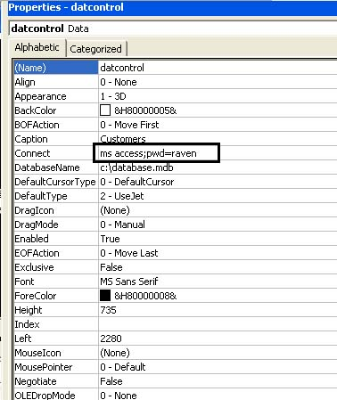



## DAO database Password Support

### Description

For people who still use the DAO data control to acess MICROSOFT Access Databases , Here's what's been missing from the control , A way to access a database with a password
 
### More Info
 

             |
---                |---
**Submitted On**   |
**By**             |[Fathi Alsharif\(Raven\)](https://github.com/Planet-Source-Code/PSCIndex/blob/master/ByAuthor/fathi-alsharif-raven.md)
**Level**          |Intermediate
**User Rating**    |5.0 (15 globes from 3 users)
**Compatibility**  |VB 4\.0 \(32\-bit\), VB 5\.0, VB 6\.0, VB Script, VBA MS Access
**Category**       |[Databases/ Data Access/ DAO/ ADO](https://github.com/Planet-Source-Code/PSCIndex/blob/master/ByCategory/databases-data-access-dao-ado__1-6.md)
**World**          |[Visual Basic](https://github.com/Planet-Source-Code/PSCIndex/blob/master/ByWorld/visual-basic.md)
**Archive File**   |

### Source Code

In the connect Property as you can see , all you have to do is replace the default code with the code in the picture , ofcourse with the password you apply  pwd=yourpasswordhere ........Enjoy

